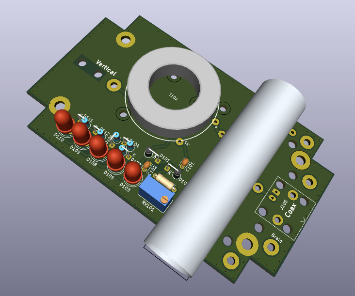

# SignalStreamer
A simple, compact, effective 80m radio orienteering transmit antenna

SignalStreamer is an 80-meter-band radio-orienteering (ARDF) transmit antenna kit designed to operate in the Amateur Radio Service 3.5 MHz to 3.7 MHz frequency range. The antenna is the perfect complement to the SignalSlinger 80m transmitter. It even fits into an identical box!

The SignalStreamer project is 100% Open Source. All the KiCad hardware design documents are available for download from this GitHub repository.

User Manual: <a href="https://docs.google.com/document/d/1ixdft7eyVAQ5lvPSUMsNJx15NzzCWhzimSsPBIRxByI/edit?usp=sharing">Assembly & User Manual</a>.

A matching transmitter: <a href="https://github.com/OpenARDF/SignalSlinger">SignalSlinger</a>.

